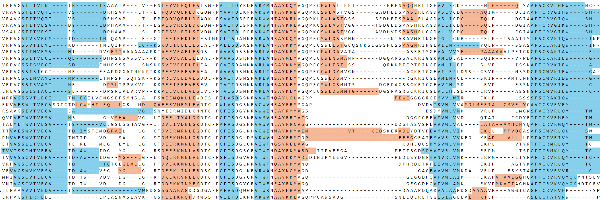

 # SecAlignVisualizer

SecAlignVisualizer is a tool for visualizing multiple sequence alignments with secondary structure annotations. It parses `.PDB` files to extract helix and sheet information, maps this information to sequence alignments, and generates an `.HTML` representation with color-coded secondary structures.


## Features

- Parse PDB files to extract helix and sheet secondary structure information.
- Map secondary structure information to sequence alignments.
- Generate HTML representations of sequence alignments with color-coded secondary structures.

### What you need to run
- `.PDB` files where each one contain the helix and sheet secondary structure information.
- `.fas` file that contain the multi-sequence alignment file

## Installation

Ensure you have Python and the required libraries installed:

```bash
pip install biopython
```

## Usage
1. Prepare `.PDB` Files: Ensure your PDB files are available in the desired directory.

2. Create Alignment: Use your favorite alignment tool (e.g., Clustal Omega, MUSCLE) to generate a multiple sequence alignment file in FASTA format (`.fas`).

3. Run the Script: Use the provided script to parse the PDB files, map the secondary structures, and generate the HTML visualization.

## Contributing
Contributions are welcome! Please fork the repository and submit a pull request for review.
